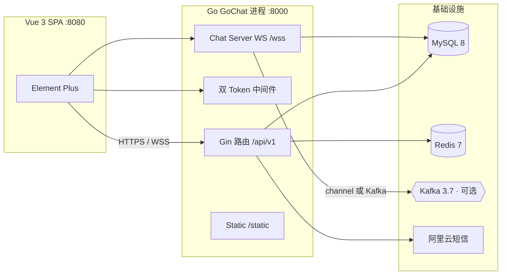

# GoChat · 高并发仿微信即时通讯系统

<div align="center">

> **GoChat** 是一个可一键运行的单实例即时通讯系统:双 Token 认证、WebSocket 长连接反压、Redis 缓存优化、channel / Kafka 双模式消息路由,全部能力有设计文档、有实现、有压测数据背书。

[](https://go.dev/)
[](https://github.com/gin-gonic/gin)
[](https://gorm.io/)
[](https://github.com/gorilla/websocket)
[](https://redis.io/)
[](https://kafka.apache.org/)
[](https://vuejs.org/)
[](LICENSE)

开发语言:Go + Vue 3 ｜ 运行形态:Docker Compose 一键启动

</div>

---

## ✨ 核心能力

- **双 Token 认证与连接安全**:15min Access(JWT)+ 7d Refresh(Redis 白名单),续期旋转 + 重放检测(旧 token 复用即撤销全部登录态)、bcrypt 哈希与存量明文懒升级、HTTP / WebSocket 统一鉴权、禁用用户即时撤销并断开连接。设计见 [`docs/design/api.md`](docs/design/api.md)。
- **WebSocket 长连接治理与反压**:读写分离 goroutine + 有界队列(全局 Transmit 100 + 每连接 100),下行非阻塞写 + 慢客户端判定断开,重连经会话拉取补齐;先落库后推送,消息 uuid 幂等,状态批量落库。设计见 [`docs/design/messaging.md`](docs/design/messaging.md)。
- **Redis 缓存优化**:SCAN 安全批量失效 + Pipeline 管道化删除 + TTL ±20% 抖动防雪崩;高频接口实测命中率与响应提升见 [`docs/notes/压测报告.md`](docs/notes/压测报告.md)。
- **channel / Kafka 双模式消息路由**:默认进程内 channel,一行配置切换 Kafka 异步路由(分区键 = receiveId 保序、acks 可配置、消费组重复消费幂等去重),共享同一套投递语义。
- **完整 IM 业务面**:单聊 / 群聊(含审核、禁言、管理员)、联系人体系(申请 / 同意 / 拉黑)、会话列表、多类型消息(文本 / 文件 / 音视频信令)、管理后台、短信验证码注册与登录(阿里云,开发模式自动降级)。

## 🏗️ 技术架构



### 技术栈

| 层 | 选型 |
| --- | --- |
| 后端 | Go 1.20 · Gin 1.10 · GORM 1.25 · go-redis/v8 · gorilla/websocket · kafka-go · zap |
| 数据 | MySQL 8 · Redis 7 · Kafka 3.7(可选,`messageMode=kafka`) |
| 认证 | JWT 双 Token · bcrypt · Redis 白名单 · HTTP/WS 统一中间件 |
| 短信 | 阿里云 Dysmsapi,无 AK 时自动降级开发模式(验证码写 Redis + 日志打印) |
| 前端 | Vue 3 · Element Plus · Vuex · axios · vue-cli 5 |

## 🚀 快速开始

需要:Docker Desktop(已含 MySQL / Redis 镜像拉取),或本机 Go 1.20+ / Node 18+。

```powershell
# 一键启动全部服务(mysql + redis + backend + frontend)
docker compose up -d --build

# 前端     http://localhost:8080
# 后端     http://localhost:8000
# 默认账号 13600000000 / 123456(管理员 18032353211 / 123456)
```

本机直接跑后端 + 已装依赖:

```powershell
$env:APP_ENV = "dev"
go run ./cmd/gochat                                     # API + WS :8000

cd web/chat-server
npm install
npm run serve                                           # 前端 :8080
```

- 前端按页面 hostname 自动推导 API / WS 地址:局域网 / 手机访问 `http://<服务器IP>:8080` 即可直连同 IP 的 8000,无需改配置。
- 短信验证码默认开发模式:验证码写入 Redis 并在后端日志打印(`docker logs gochat-backend`),注册 / 短信登录无需真实短信通道;配置真实 AK 后置 `GOCHAT_SMS_DEV_MODE=false` 走阿里云。
- 切换 Kafka 模式:`docker compose up -d kafka` 后以 `CONFIG_FILE=configs/config.kafka.toml` 启动后端。

完整命令与配置说明见 [`docs/notes/演示与部署说明.md`](docs/notes/演示与部署说明.md)。

## 🧪 压测与证据(实测入仓,不冒充生产 SLA)

小型 Go 压测客户端 `bench/`(conn / chat / group / slow / api 五场景),全部数字有可复现方法与固定环境记录,详见 [`docs/notes/压测报告.md`](docs/notes/压测报告.md)。

| 项 | 实测结果 |
| --- | --- |
| 长连接规模 | 3000 并发连接 100% 保持(5000 可建连),600s soak 零掉线、goroutine 恒定、堆内存无单调增长 |
| 消息端到端延迟 | channel 模式容量内 **P99 = 19.5ms**;Kafka 模式容量内 100 对 P99 = 71ms |
| 群聊风暴 | 100 人 × 30 条广播(预期扇出 30000):**每成员 100% 送达、零丢失、零误断** |
| 慢客户端治理 | 0.3–0.5s 阈值断开,注入慢客户端时 50 个正常客户端 100% 送达、0 异常断开 |
| Redis 缓存 | 高频接口实测命中率 **99.75%**;接口 P95 由 4.8ms 降至 2.2ms(-54%);DB 查询量降低 90%+ |
| Kafka 消费上限 | 批量落库后单实例 **≥1000 msg/s**(约 7 倍于修复前 147 msg/s),200 msg/s 下 P99 316ms 且零积压 |
| 消费幂等 | Kafka 重复消费 / 重放 13438 条消息,DB **零新增行**(SETNX + uuid 去重) |
| 崩溃恢复 | 消费中 kill 重启 **10000/10000 零丢失**;MySQL / Redis / Kafka 依次停机均零丢失、恢复自愈 |

## 📚 文档

- [文档总览](docs/README.md) — 架构、设计、决策、压测索引
- [系统架构](docs/design/system-architecture.md) · [消息管道](docs/design/messaging.md) · [API 与鉴权](docs/design/api.md)
- [数据库设计](docs/design/database.md) · [领域模型](docs/design/domain-and-state-machine.md) · [交付计划](docs/design/delivery-plan.md)
- [压测报告](docs/notes/压测报告.md) · [修复日志](docs/notes/修复日志_P0_P1.md) · [演示与部署说明](docs/notes/演示与部署说明.md)
- [OpenAPI 3 接口清单](docs/gochat-openapi3.json)

## 📄 许可证

本项目基于 **MIT 许可证**开放（见 [LICENSE](LICENSE)）。

> 演示环境使用本地构造的测试账号与数据,不含真实客户信息;仓库内不保留真实密钥(短信 AK / JWT 密钥均经 `.env` 或环境变量注入,`.env` 与本地配置不入版本库)。
