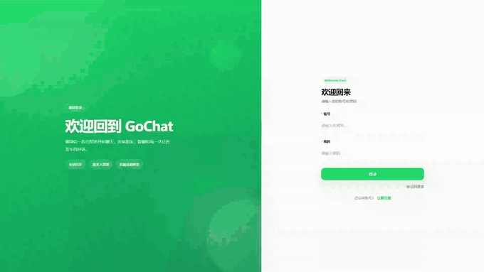
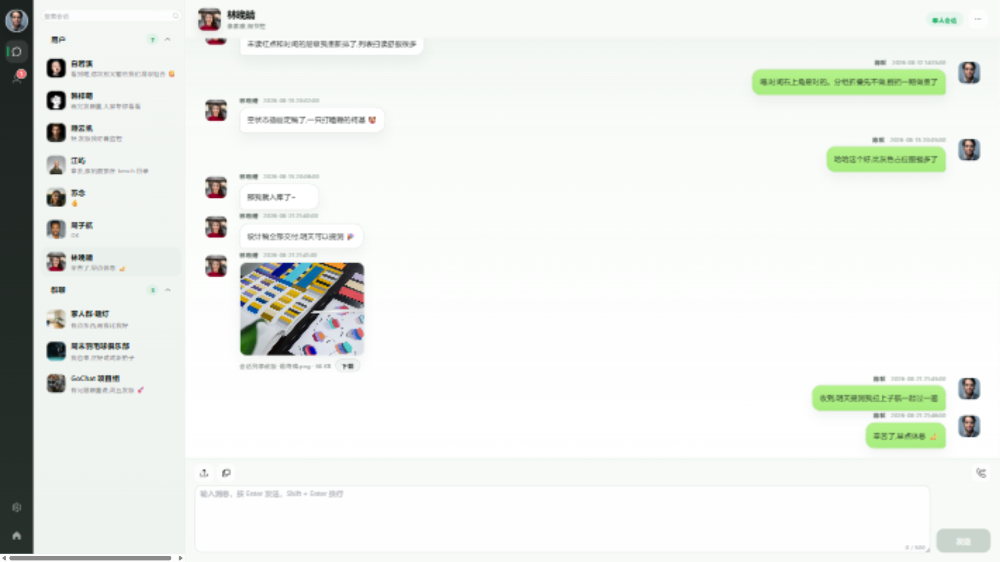
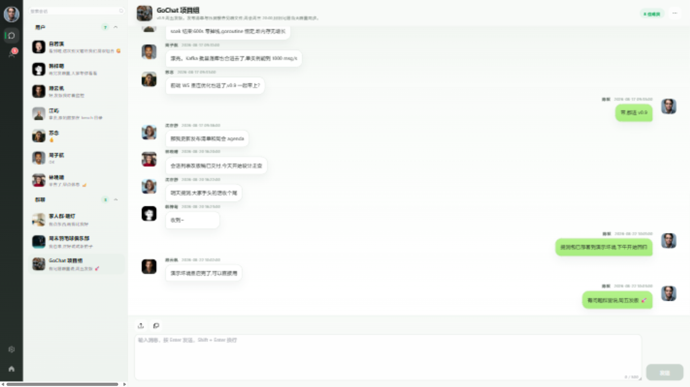
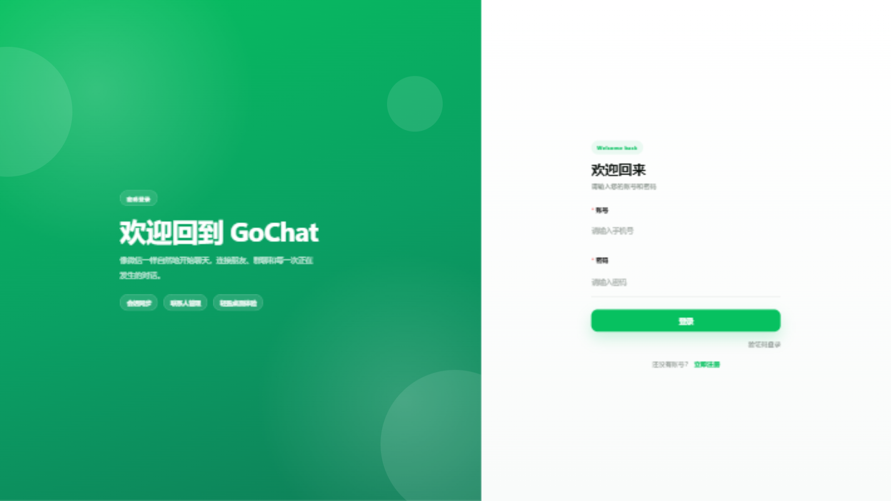
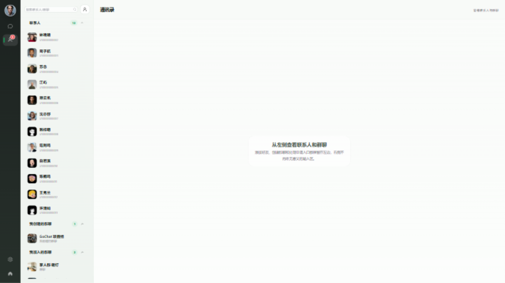
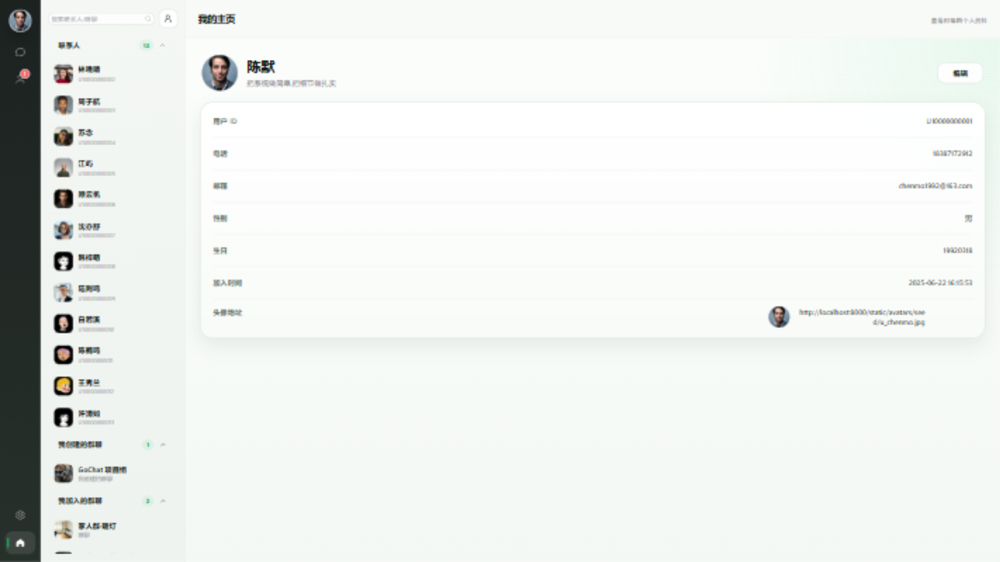
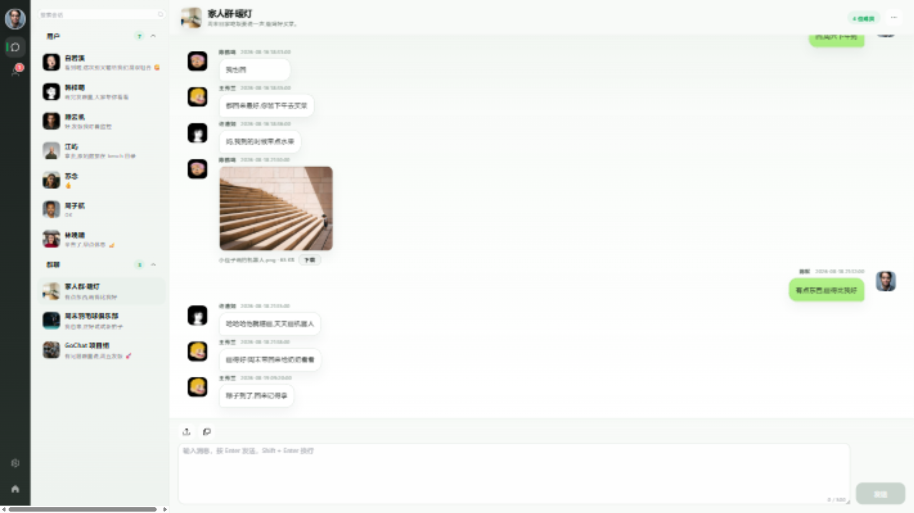
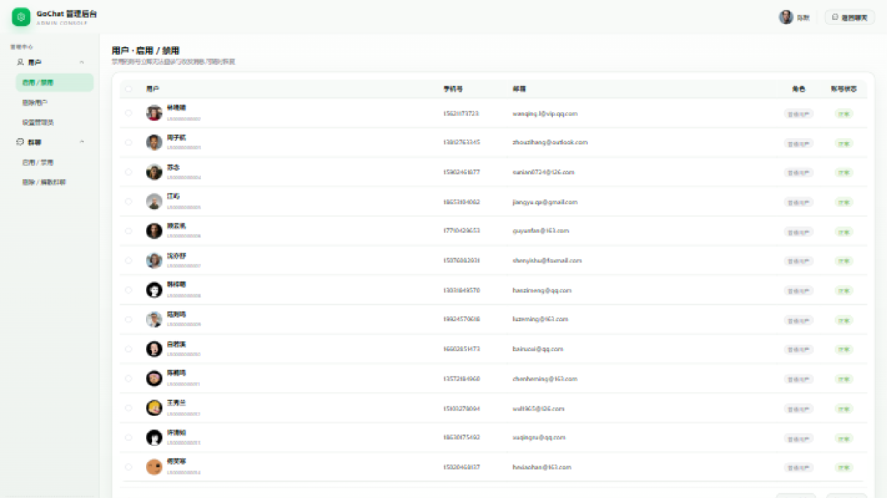
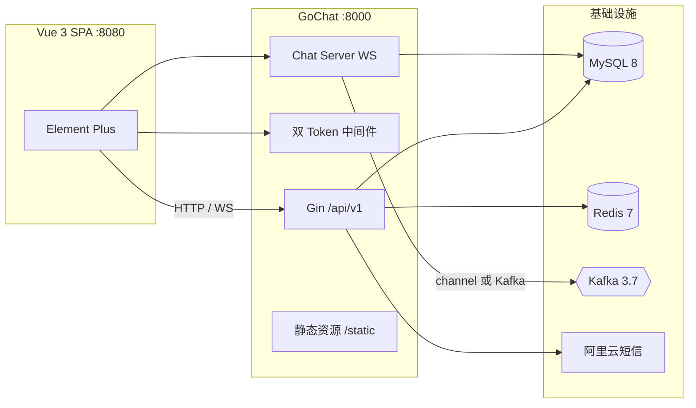

# GoChat

<div align="center">

基于 Go 与 Vue 3 的即时通讯系统:单聊 / 群聊、双 Token 认证、WebSocket 长连接治理、
channel / Kafka 双模式消息路由,Docker Compose 一键部署。

[](https://go.dev/)
[](https://github.com/gin-gonic/gin)
[](https://gorm.io/)
[](https://github.com/gorilla/websocket)
[](https://redis.io/)
[](https://kafka.apache.org/)
[](https://vuejs.org/)
[](LICENSE)

</div>

## 功能特性

- **消息**:单聊 / 群聊,文本、图片、文件消息;先落库后推送,消息 uuid 幂等;会话列表展示最近消息预览与未读数
- **连接**:WebSocket 读写分离 goroutine,全局 + 每连接有界队列反压,慢客户端判定断开,断线重连后按会话补齐
- **认证**:15min Access Token(JWT)+ 7d Refresh Token(Redis 白名单),续期旋转、重放检测、HTTP / WS 统一鉴权
- **消息路由**:进程内 channel 与 Kafka 双模式,一行配置切换,共享同一套投递语义;Kafka 分区键保序、消费组幂等去重
- **联系人**:好友申请 / 同意 / 拒绝 / 拉黑,群聊审核加群(直接加入 / 群主审核)
- **管理后台**:用户启用 / 禁用 / 删除 / 设置管理员,群聊启用 / 禁用 / 解散
- **缓存**:Redis Pipeline 批量失效、SCAN 安全删除、TTL 抖动防雪崩
- **短信**:阿里云短信验证码注册 / 登录,无 AK 时自动降级开发模式(验证码写 Redis 与日志)

## 界面演示

截图与动图基于 [`cmd/seed`](cmd/seed/main.go) 生成的演示数据(14 个账号、3 个群聊、73 条消息)。

### 登录与实时收发消息

<p align="center"></p>

### 单聊:文本 / 图片 / 文件消息

<p align="center"></p>

### 群聊

<p align="center"></p>

<details>
<summary>更多界面</summary>

登录页(密码登录 / 短信验证码登录):

<p align="center"></p>

通讯录:

<p align="center"></p>

个人资料:

<p align="center"></p>

家人群:

<p align="center"></p>

管理后台:

<p align="center"></p>

</details>

## 架构



| 层 | 选型 |
| --- | --- |
| 后端 | Go 1.20 · Gin 1.10 · GORM 1.25 · go-redis/v8 · gorilla/websocket · kafka-go · zap |
| 数据 | MySQL 8 · Redis 7 · Kafka 3.7 |
| 认证 | JWT 双 Token · bcrypt · Redis 白名单 |
| 前端 | Vue 3 · Element Plus · Vuex · axios · vue-cli 5 |

## 快速开始

前置条件:Docker Desktop;本机开发可选 Go 1.20+ 与 Node 18+。

```bash
# 启动全部服务(mysql + redis + kafka + backend + frontend)
docker compose up -d --build

# 可选:重建演示数据(账号、群聊、聊天记录、头像与文件素材)
go run ./cmd/seed --force
docker compose cp static/avatars/seed backend:/app/static/avatars/
docker compose cp static/files/seed backend:/app/static/files/
```

启动后:

| 服务 | 地址 |
| --- | --- |
| 前端 | http://localhost:8080 |
| 后端 API | http://localhost:8000/api/v1 |

演示账号(密码统一 `123456`,完整列表见 [`cmd/seed/main.go`](cmd/seed/main.go)):

| 账号 | 角色 |
| --- | --- |
| 18387172912 | 管理员(陈默) |
| 15621173723 | 普通用户(林晚晴) |

其余 12 个账号为构造的手机号。短信默认开发模式,验证码仅写入 Redis 与后端日志
(`docker logs gochat-backend`),不会真实发送;配置真实 AK 后设置
`GOCHAT_SMS_DEV_MODE=false` 切换阿里云短信。

本机开发(不使用 Docker):

```bash
APP_ENV=dev go run ./cmd/gochat    # API + WS :8000

cd web/chat-server
npm install
npm run serve                      # 前端 :8080
```

说明:

- 前端按页面 hostname 自动推导 API / WS 地址,局域网访问 `http://<服务器IP>:8080` 即可,无需改配置
- Docker 部署消息链路默认走 Kafka(容器网 `kafka:9092`,宿主机 `29092`,避开常见端口占用);topic 由后端启动时自动创建
- 本机开发默认 channel 模式,需要 Kafka 时以 `CONFIG_FILE=configs/config.kafka.toml` 启动

更多细节见 [`docs/notes/演示与部署说明.md`](docs/notes/演示与部署说明.md)。

## 性能压测

压测客户端位于 `bench/`(conn / chat / group / slow / api 五个场景),完整方法与环境记录见
[压测报告](docs/notes/压测报告.md)。

| 项 | 结果 |
| --- | --- |
| 长连接规模 | 3000 并发连接 600s 零掉线,goroutine 恒定,堆内存无单调增长 |
| 消息端到端延迟 | channel 模式 P99 = 19.5ms;Kafka 模式 100 对并发 P99 = 71ms |
| 群聊扇出 | 100 人 × 30 条(预期 30000 次送达)每成员 100% 送达、零丢失 |
| 慢客户端治理 | 注入慢客户端时 50 个正常客户端 100% 送达、零误断 |
| Redis 缓存 | 高频接口命中率 99.75%,P95 由 4.8ms 降至 2.2ms,DB 查询量降低 90%+ |
| Kafka 消费 | 单实例 ≥1000 msg/s 批量落库,200 msg/s 下零积压 |
| 消费幂等 | 重放 13438 条重复消息,DB 零新增行 |
| 崩溃恢复 | 消费中 kill 重启 10000/10000 零丢失;MySQL / Redis / Kafka 依次停机均自愈 |

## 文档

- [文档总览](docs/README.md)
- [系统架构](docs/design/system-architecture.md) · [消息管道](docs/design/messaging.md) · [API 与鉴权](docs/design/api.md)
- [数据库设计](docs/design/database.md) · [领域模型](docs/design/domain-and-state-machine.md) · [交付计划](docs/design/delivery-plan.md)
- [压测报告](docs/notes/压测报告.md) · [修复日志](docs/notes/修复日志_P0_P1.md) · [演示与部署说明](docs/notes/演示与部署说明.md)
- [OpenAPI 3 接口清单](docs/gochat-openapi3.json)

## 许可证

[MIT](LICENSE)

演示数据为本地构造,不含真实用户信息;短信 AK、JWT 密钥等敏感配置经 `.env` 或环境变量注入,不入版本库。
